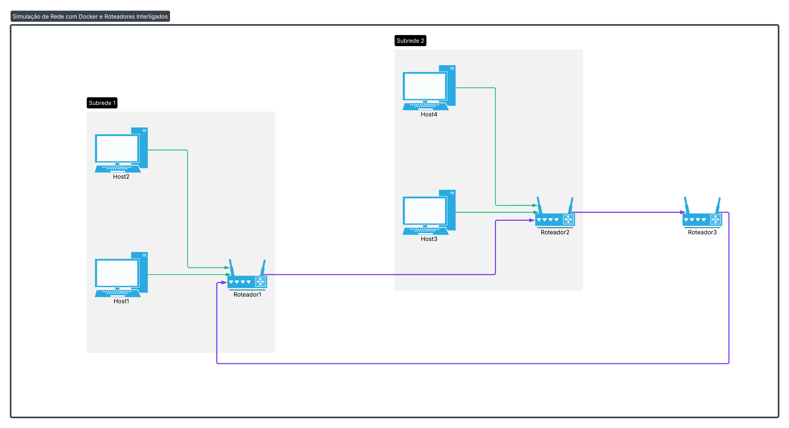

# Projeto de Redes de Computadores 2

Este projeto simula uma rede de computadores utilizando Docker e docker Compose, composta por três roteadores interligados e quatro hosts, divididos em **duas subredes. O objetivo principal é aplicar conceitos de roteamento, troca de mensagens via UDP, e cálculo de rotas com o algoritmo de Dijkstra.

---
## Como Executar o Projeto

1. Clone o repositório:

   ```bash```
   git clone https://github.com/gehhsantos/projeto-redes2.git
   cd projeto-redes2 

 2. Construa e execute os containers com Docker Compose:

 ```bash```
docker-compose up --build

3. Para interromper a simulação, pressione Ctrl + C no terminal onde o Docker está rodando ou execute:

``` bash```

docker-compose down

---
##  Justificativa do Protocolo Escolhido

O protocolo UDP foi escolhido para a comunicação entre os roteadores por sua leveza, simplicidade e baixo overhead. Como o objetivo é simular o envio constante de pacotes de estado de enlace entre roteadores, o UDP é ideal por não exigir estabelecimento de conexão nem controle de congestionamento, o que garante maior desempenho e simplicidade na implementação do protocolo de roteamento.

---
## Como a Topologia foi Construída

A topologia da rede foi construída com base em três redes bridge definidas no docker-compose.yml:

- rede1: conecta host1, host2 e roteador1;
- rede2: conecta host3, host4 e roteador2;
- rede_backbone: conecta os três roteadores: roteador1, roteador2, roteador3.

Os roteadores são responsáveis por repassar pacotes entre as subredes, aplicando o algoritmo de Dijkstra para manter suas tabelas de rotas atualizadas. A comunicação entre os roteadores acontece via rede_backbone, que simula uma rede de backbone compartilhada. Os hosts não se conectam diretamente entre si, mas sim através dos roteadores.

Conexões entre os roteadores:

- roteador1 ↔ roteador2
- roteador2 ↔ roteador3
- roteador3 ↔ roteador1

Essa topologia garante conectividade parcial entre os roteadores, como exigido na especificação.

---
## Tecnologias Utilizadas

- Docker
- Docker Compose
- Python 3.9
- Redes Virtuais Bridge
- UDP
- Algoritmo de Dijkstra (em Python)

---
## Estrutura da Rede



---
## Licença

Este projeto é apenas para fins acadêmicos da disciplina Redes de Computadores 2 - — Universidade Federal do Piauí (UFPI).

---

> Projeto desenvolvido por Geovana Santos — UFPI – Sistemas de Informação

